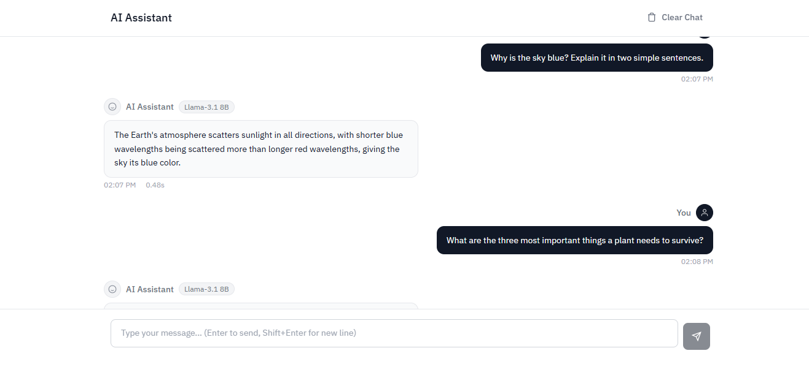

# GenAI Flask App (AI Assistant)

This is a web-based AI Assistant powered by Llama-3.1-8b via Groq, built with Flask and LangChain.



## Features

- **Conversational Interface**: Chat UI built with plain HTML, CSS, and JavaScript.
- **Fast Inference**: Uses Groq's high-speed inference engine with Llama-3.1-8b.
- **LangChain Integration**: LangChain is used to structure the AI's generation process.
- **Responsive Design**: Works on desktop and mobile browsers.

## Project Structure

- `app.py`: Main Flask application entry point.
- `model.py`: Configuration and initialization for the LangChain model and Groq client.
- `requirements.txt`: Python dependencies.
- `templates/index.html`: The main web interface.
- `static/`: Contains the CSS (`styles.css`) and JavaScript (`script.js`) for the frontend.

## Prerequisites

- Python 3.8+
- A Groq API Key

## Setup and Installation

1. **Clone the repository (if applicable):**
   ```sh
   git clone https://github.com/nabeelshan78/genai_flask_app.git
   cd genai_flask_app
   ```

2. **Create a virtual environment:**
   ```sh
   python -m venv venv
   # On macOS/Linux
   source venv/bin/activate
   # On Windows
   venv\Scripts\activate
   ```

3. **Install dependencies:**
   ```sh
   pip install -r requirements.txt
   ```

4. **Environment Variables:**
   Create a `.env` file in the root directory and add your Groq API key:
   ```env
   GROQ_API_KEY=your_groq_api_key_here
   ```

## Usage

1. **Start the Flask server:**
   ```sh
   python app.py
   ```

2. **Access the application:**
   Open your web browser and navigate to `http://localhost:5000` (or the URL provided in the terminal).

## Technologies Used

- [Flask](https://flask.palletsprojects.com/)
- [LangChain](https://www.langchain.com/)
- [Groq](https://groq.com/)
- HTML/CSS/JavaScript
